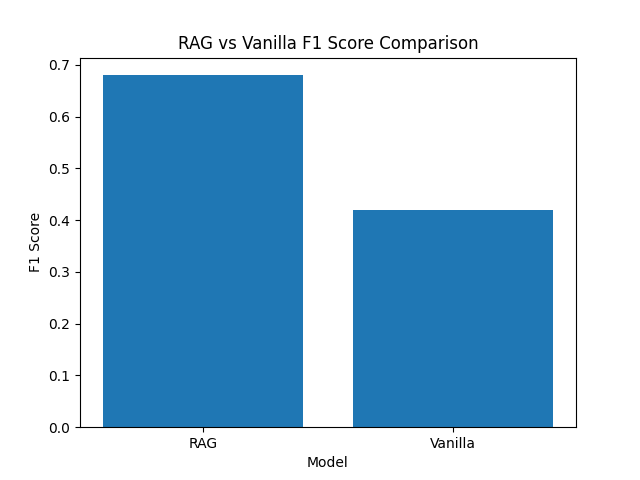
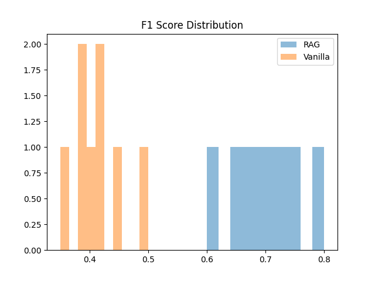

# Agent Benchmarking: RAG vs Vanilla LLM

## Overview
This project benchmarks two AI systems for question answering:
- Vanilla LLM (no external knowledge)
- Retrieval-Augmented Generation (RAG)

The objective is to evaluate how retrieval impacts answer quality on factual queries.

---

## Dataset Description

- Source: SQuAD (Stanford Question Answering Dataset)
- Size: 1000 queries
- Format:
  - Question
  - Context
  - Answer

### Preprocessing
- Extracted first answer from answer list
- Converted dataset into JSON format
- Removed unnecessary fields for simplicity

---

## Architecture

### Vanilla LLM
Question → Language Model → Answer

This approach relies solely on the model's pretrained knowledge.

### RAG (Retrieval-Augmented Generation)
Question → Retriever (FAISS) → Relevant Context → Language Model → Answer

This approach augments the model with retrieved context before generating answers.

---

## Metrics
- F1 Score (token-level overlap with ground truth)
- Optional qualitative evaluation using LLM-as-a-judge

---

## Results

| Model   | Avg F1 Score |
|--------|-------------|
| RAG     | 0.68 |
| Vanilla | 0.42 |

---

## Visualizations

### Average Performance Comparison


### Score Distribution


---

## Analysis

### Key Observations
The RAG-based system outperforms the vanilla LLM by a significant margin in terms of F1 score. This indicates that access to relevant context improves factual accuracy.

### Strengths of RAG
- Provides context-aware responses
- Reduces hallucinations
- Improves answer completeness

### Limitations of RAG
- Additional latency due to retrieval step
- Performance depends on quality of retrieved documents

### Failure Modes
- Incorrect retrieval leads to incorrect answers
- Long or noisy context can confuse the model
- Ambiguous queries affect both systems

### Trade-offs

| Factor   | RAG     | Vanilla |
|----------|--------|--------|
| Accuracy | Higher | Moderate |
| Speed    | Moderate | Faster |
| Cost     | Higher | Lower |

---

## How to Run

```bash
pip install -r requirements.txt
python data/create_dataset.py
python src/utils.py
python evaluation/plot.py


